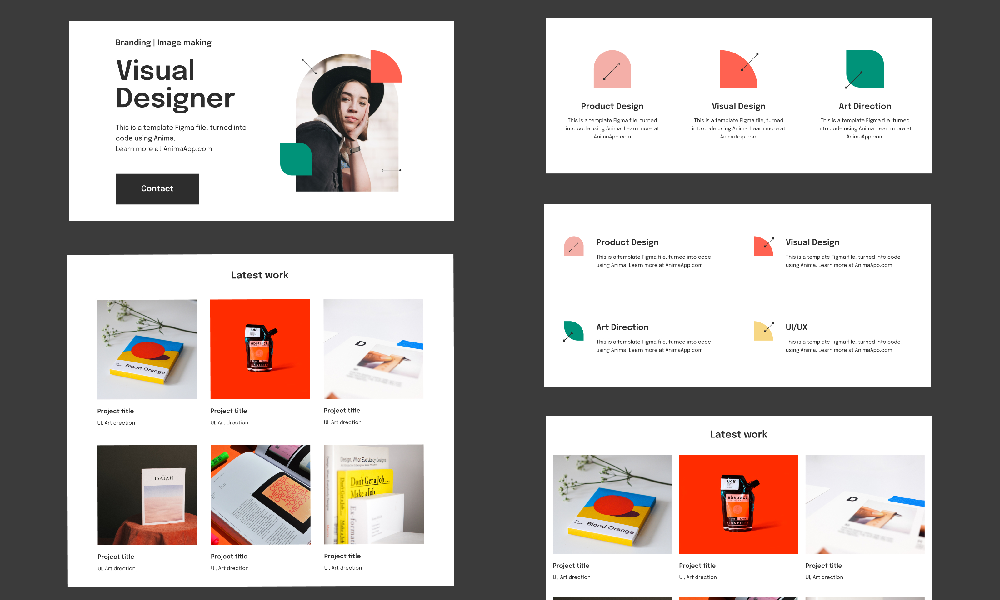

 
<h1 align="center"> Visual Designer Portfolio Landing Page</h1>

 

<h3>This Resource Here Is Completely For The Purpose Of Practise a
And Learning.</h3>

 

This is my shot at a free design resource made by Anima which I found online and used for the purpose of practise and self learning.

 

### The challenge

- Building the project to be close to the design as much as possible.

- This is a good project to practise CSS stacking context.

### Links

- Check out the website[here](https://the-odin-homepage.netlify.app/)

### Built with

- Semantic HTML5 markup
- CSS custom properties
- Flexbox
- CSS Grid
- CSS Stacking context
- Mobile-first workflow
- BEM Methodology

### What I learned

- Proper image sizing and control.
- How to combine Flexbox and Grid to achieve responsive layouts.
- More practise on CSS stacking context

## Author

- Divine Ugorji
- Twitter - [@DivineUgorji](https://www.twitter.com/DivineUgorji)

## References

- Design by [Anima](https://www.animaapp.com)
